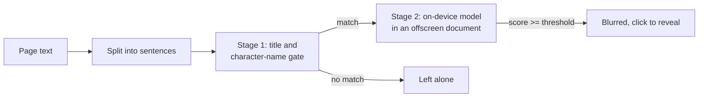

# Spoiler Shield

**A browser extension that blurs film and TV spoilers as you scroll, using a small ML model that runs entirely on your device.**

Pick the shows you're still watching. Spoiler Shield reads comment threads on Reddit, Letterboxd and YouTube, scores each sentence with an on-device transformer, and blurs the ones that give things away. No page text ever leaves your browser.

> **Status: Phase 0 complete (feasibility spike).** The extension runs a MiniLM-L6-sized model inside Chrome within the latency budget. The current model has **random weights**, so it proves the plumbing and the speed, not the quality. Training starts in Phase 1. See the [build plan](#roadmap).

## Why this project

This is an end-to-end machine learning engineering project, built in the open:

- **Data:** sentence-level spoiler labels from public review datasets, plus LLM-assisted labelling checked against human labels.
- **Modelling:** a large teacher model distilled into a small student, then quantised to int8.
- **Evaluation:** splits by title so the model can't memorise character names, a test set used once per release, and a quality gate in CI.
- **Deployment:** in-browser inference with ONNX Runtime Web in a Manifest V3 extension, with no server.
- **Feedback loop:** opt-in "spoiler or not" ratings feed the next training round.

## How it works



Stage 1 arrives in Phase 4. Today every sentence goes straight to the model.

## Phase 0 results

The feasibility spike measured the MiniLM-L6 architecture (22.7M parameters) in headless Chromium, with WebAssembly on 4 threads. Full numbers are in [docs/results/phase0-spike-latency.md](docs/results/phase0-spike-latency.md).

| Measure | Budget | Spike result |
| --- | --- | --- |
| Model download, int8 | 30 MB or less | 22.9 MB |
| p95 latency per sentence, batches of 16 | 15 ms or less | about 7 ms |
| p95 latency, one sentence at a time | not budgeted | about 25 ms |

Scoring has to be batched to meet the budget, and the content script already does this. The numbers come from a shared cloud container, so treat them as indicative.

## Quickstart

Requirements: Python 3.11, [uv](https://docs.astral.sh/uv/), Node 22 and pnpm.

```bash
make setup      # Python deps with training extras, extension deps
make check      # lint, typecheck and unit tests for both halves
make e2e        # build the spike model and extension, run end-to-end tests in Chromium
make bench      # in-browser latency benchmark, writes docs/results/
```

To try the extension by hand, run `make spike-model build-ext`, then load `extension/.output/chrome-mv3` as an unpacked extension in `chrome://extensions`.

## Repository layout

```text
ml/          Python package: data, training, evaluation, ONNX export
extension/   Chrome extension (TypeScript, WXT): content script, offscreen model host
api/         Opt-in feedback API (Phase 5)
docs/        Design, results, model and dataset cards, blog drafts
```

## Roadmap

| Phase | Goal | Status |
| --- | --- | --- |
| 0 | Feasibility spike: model in the browser within budget | Done |
| 1 | Data, leak-free splits, baselines | Next |
| 2 | LLM-assisted labelling and teacher model | Planned |
| 3 | Distilled, quantised student model | Planned |
| 4 | Extension MVP: gate, site adapters, settings | Planned |
| 5 | Chrome Web Store launch and feedback loop | Planned |

The full design is in [docs/DESIGN.md](docs/DESIGN.md).

## Licence

MIT. See [LICENSE](LICENSE).
