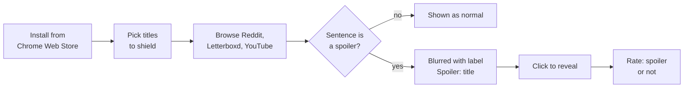
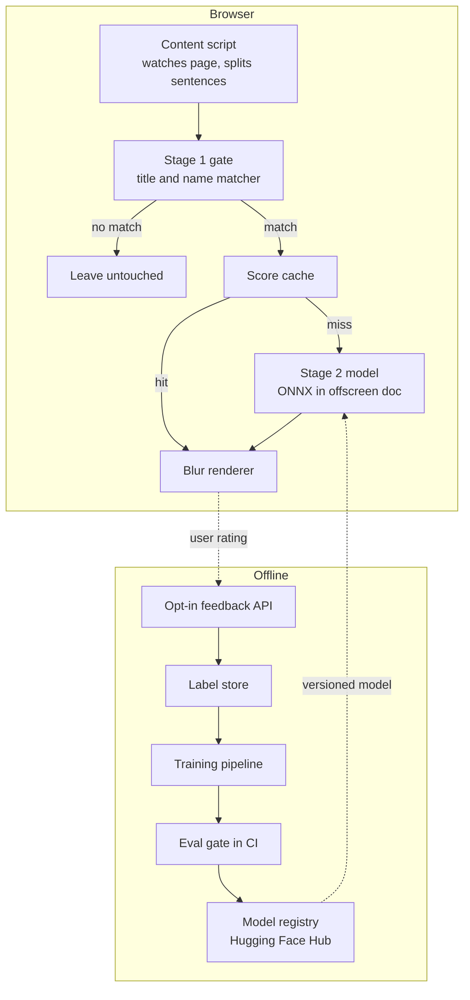

# Spoiler Shield: design

Spoiler Shield is an open-source browser extension that blurs spoiler sentences about the films and shows you choose, using a small model that runs entirely on your device. v1 covers Reddit, Letterboxd and YouTube comments, ships a model under 30 MB, and is judged on titles it never saw in training.

## Goals and non-goals

v1 succeeds when a fan halfway through a show can read its subreddit without being spoiled, and the extension feels invisible until it saves them.

**v1 must:**

1. Blur individual spoiler sentences, not whole pages, for the titles on the user's shield list.
2. Run fully on-device, so no page text ever leaves the browser.
3. Keep scrolling smooth on a mid-range laptop.
4. Let users reveal a sentence in one click, and mark "missed spoiler" or "not a spoiler" in one click.

**Success criteria.** These targets are provisional until the Phase 1 baselines are measured.

| Measure | v1 target | Why it matters |
| --- | --- | --- |
| Spoiler recall on unseen titles | 0.90 or higher | A missed spoiler is the failure users remember |
| False-blur rate on non-spoiler sentences | 10% or lower | Past this, people turn the extension off |
| p95 inference latency per sentence, laptop CPU | 15 ms or lower | Blurring must land before the reader gets there |
| Model download size | 30 MB or less | Install must feel instant |
| Weekly active users 8 weeks after launch | 50 or more | Proof real people use it |

**Not in v1:** images and video thumbnails, mobile browsers, languages other than English, server-side inference, and books.

## User experience

The user picks the titles to protect once, then browses as normal while risky sentences arrive already blurred.

- **Shield list:** search a title and add it. Each entry pulls the title's cast and character names for the first-stage filter.
- **Sensitivity:** Cautious, Balanced or Relaxed, each mapped to a calibrated model threshold.
- **Per-site switches and a one-hour pause.**
- **A counter** such as "14 spoilers blocked today".
- **v2 stretch:** progress-aware shielding, where only events after the episode you're on are blurred.

## System architecture

Inference is a two-stage cascade that runs entirely in the browser. The training and feedback loop runs offline and ships new models as versioned files.

Most sentences on a page don't mention a shielded title. A string matcher over title, cast and character names is nearly free and removes most of them before the model runs. Scores are cached by sentence hash.

| Component | Technology | Responsibility |
| --- | --- | --- |
| Extension shell | TypeScript, WXT, Manifest V3 | Content scripts, popup, settings storage |
| Stage 1 gate | Aho-Corasick matcher | Keep only sentences mentioning a shielded title or its characters |
| Stage 2 model | transformers.js on ONNX Runtime Web, WASM with threads, WebGPU later | Spoiler probability per sentence, with title context |
| Title metadata | TMDB via a small proxy | Cast and character names, so no API key ships in the extension |
| Feedback API | Cloudflare Worker with D1 | Receive opt-in ratings, rate-limit, strip page context |
| Training and registry | Python, Hugging Face Hub | Train, evaluate, publish versioned models with model cards |

**Confirmed in Phase 0:** the model runs in an offscreen document. Extension pages are cross-origin isolated so ONNX Runtime can use WASM threads, and all runtime files ship inside the package.

## ML design

The model predicts the probability that one sentence spoils a named title. A large teacher learns the task, and a small distilled student ships in the browser.

**Task framing.** The input is the title name, the sentence, and the sentence before it. Title conditioning matters because spoiler language is largely specific to each work.

| Dataset | Size | Labels | Role |
| --- | --- | --- | --- |
| Goodreads spoilers, Wan et al., ACL 2019 | About 1.3M reviews of about 25k books | Sentence-level, from reviewers' spoiler tags | Main sentence-level supervision |
| IMDB Spoiler Dataset, Misra | 573,913 reviews of 1,572 films | Review-level only | Film domain, plus plot synopses for the labeller |
| Gold set, ours | About 2,000 sentences from Reddit, Letterboxd and YouTube | Sentence-level, hand-labelled | Final test set only |
| User feedback | Grows after launch | Sentence-level, noisy | Retraining and drift monitoring |

**Labelling.** An LLM labeller marks which sentences of each flagged IMDb review spoil the film, reading the plot synopsis. Weak labels are used only if they agree with 500 hand labels at Cohen's kappa 0.7 or higher.

| Step | Model | Purpose |
| --- | --- | --- |
| 0 | Keyword rules | Floor to beat |
| 1 | TF-IDF with calibrated logistic regression | Honest classical baseline |
| 2 | Teacher: ModernBERT-base or DeBERTa-v3-base with title context | Quality ceiling |
| 3 | Student: MiniLM-L6-sized encoder distilled from the teacher | The model that ships |
| 4 | Student as int8 ONNX | Meets size and latency budgets |

Temperature scaling calibrates probabilities. Each sensitivity setting maps to a threshold chosen on validation data for a target recall: 0.95 Cautious, 0.90 Balanced, 0.80 Relaxed.

## Evaluation

- **Split by title, not by row,** so the model can't memorise character names.
- **Two test sets:** held-out Goodreads and IMDb titles, and the real-site gold set, which is the number that counts.
- **Test once per release.** All choices use validation data.
- **Metrics:** recall and false-blur rate at the Balanced threshold, PR-AUC, expected calibration error, and Stage 1 gate recall.
- **Slices:** site, genre, sentence length, and whether the sentence names a character.
- **CI quality gate:** fail the build if recall drops more than one point or the model exceeds 30 MB.

## Privacy

- All inference runs on the device. Page text never leaves the browser.
- Host permissions cover only the supported sites.
- Feedback is off by default and sends only the sentence, title and rating.

## Risks

| Risk | Mitigation |
| --- | --- |
| Book reviews don't transfer to Reddit and YouTube language | The gold set measures the gap. Film data and feedback close it. |
| Dataset terms may bar redistributing trained weights | Check before the first public model. Fallback to permitted data only. |
| Chrome Web Store bans remotely hosted code | ONNX Runtime WASM is bundled. Only model weights are data. |
| Slow on older laptops | Cascade, batching, caching, multi-threaded WASM. |
| The name gate misses spoilers that name nobody | Measure gate recall and add page context as a second trigger. |
| Feedback gets spammed or poisoned | Rate limits, and human review before any retrain. |
